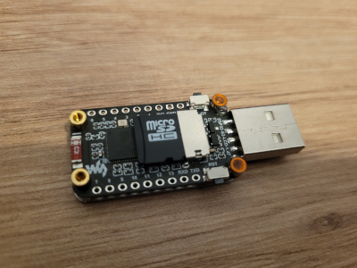

# ns-thingy
"That thingamajig is a USB blood sugar display unit."

 

## What do I need to have my own working ns-thingy?
1. [Nightscout page](https://nightscout.github.io/) - this is the only source of data so it's **required** (but you are here, so you should have it already)
2. [ESP32-S3-LCD-1.47](https://www.waveshare.com/esp32-s3-lcd-1.47.htm) - the hardware part of the ns-thingy
3. SD Card - probably the cheapest/smallest one possible (formatted as FAT32), the one from the old phone will be great
4. SD Card reader - to copy the configuration file onto the card
5. Wifi connection
6. USB-A port

## OK, got it - what now?
1. Create a local directory we'll store all the Arduino (name of this hardware platform) stuff 
2. Clone/download the ns-thingy repository into the "Arduino" directory
3. Install [Arduino IDE](https://www.arduino.cc/en/software) - that's the app we'll use to program the ns-thingy
4. Configure Arduino IDE - use points below, you may get more information [here](https://www.waveshare.com/wiki/ESP32-S3-LCD-1.47) 
    1. File->Preferences: set the "Sketchbook location" to the path of the "Arduino" directory
    1. File->Preferences: set the "Additional boards manager URLs" to "https://espressif.github.io/arduino-esp32/package_esp32_index.json" (without quotes)
   
    1. Tools->Board: set to "ESP32S3 Dev Module"
    1. Tools->Port: set to "COM13" (Windows?) or "/dev/ttyACM0"
    1. Tools->USB CDC On Boot: set to "Enabled" 
    1. Tools->Flash Size: set to "16MB (128Mb)"
    1. Tools->Partition Scheme: set to "16MB Flash (#MB APP/9.9MB FATFS)"
    1. Tools->PSRAM: set to "OPI PSRAM"
5. Download following libraries using the Library Manager in Arduino IDE:
    1. Arduinojson@7.3.0
    1. HttpClient@2.2.0 
    1. TFT_eSPI@2.5.43

   
6. Copy the file LibConfig/User_Setup.h from this repo (or local directory) to the "Arduino"\libraries\TFT_eSPI directory
7. Edit the SDCard/config.json file from this repo to provide your own configuration (should be self-explanatory):
```
{
"wifi_ssid":"YOUR_WIFI_NETWORK_NAME",
"wifi_password":"YOUR_WIFI_NETWORK_PASSWORD",
"nightscout_url":"https://YOUR_NIGHTSCOUT_ADDRESS",
"access_token":"",
"mmol":false,
"use_led":true,
"rotate":false
}
```
8. Make sure the SD card is formatted as FAT32 to avoid potential issues - use [Rufus](https://rufus.ie) to format it if in doubt
9. Copy the updated config.json into the root of the SD Card (single file, don't create any directories)
10. Insert the SD Card into the slot in the back of ns-thingy 
11. Open the ns-thingy.ino sketch in Arduino IDE if you haven't already  
12. If you are still reading this: plug your ns-thingy into the USB port of your PC
13. Select the proper board from the dropdown in Arduino IDE and hit "Upload"
 
14. Hopefully, you should have your own ns-thingy now ;) 